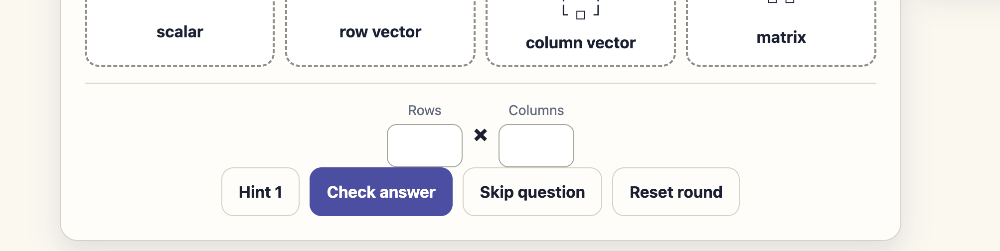
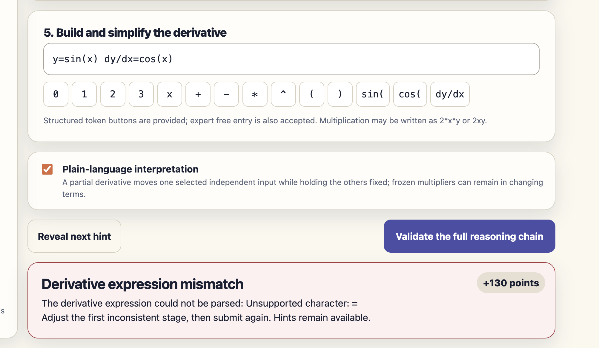
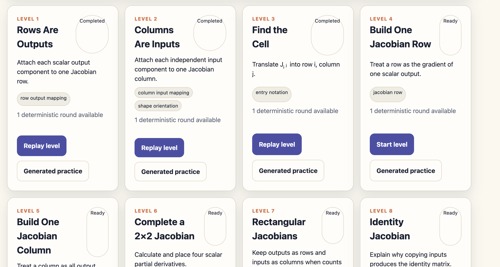
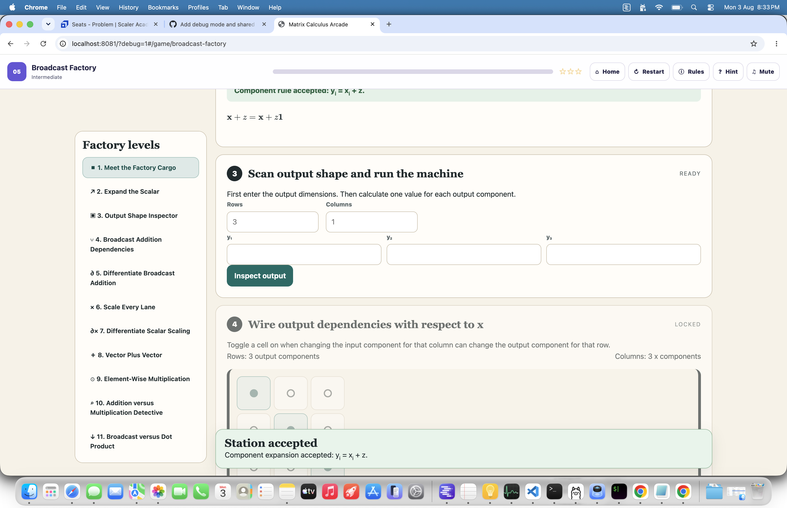
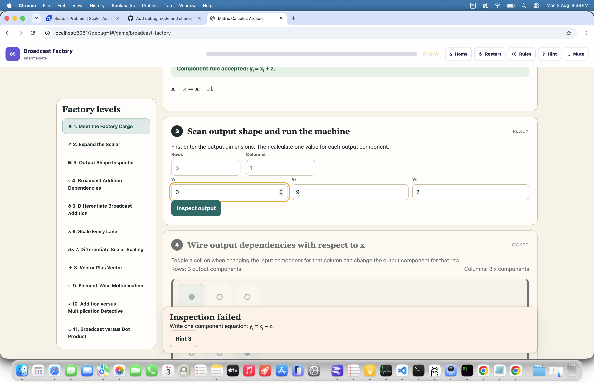
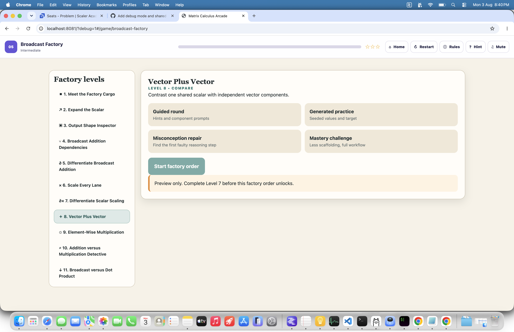

# Matrix Calculus Arcade Errata

Status: all items below are resolved in the current feature branch.

### Need more gap

Resolved: added vertical separation between Shape Sorter’s dimension panel and action buttons.

### Not clear what needs to be done here

Resolved: Partial Derivative Freeze now asks for only the simplified right-hand-side expression, warns against entering an equation or equals sign, and shows a specific example.

### The Completed and Ready pills are incomplete

Resolved: Build Jacobian status badges no longer shrink in crowded level-card headers.

### The Selection from Derivative Tray is not working

Resolved: with a cell selected, clicking a derivative tile places it immediately. Choosing a tile first retains the selection and prompts the player to choose a cell.

### Unexpected token 'eof' error, validate jacobian does not work

Resolved: blank expressions receive an actionable message, the typed-expression button identifies its target cell, and Jacobian validation continues to identify the first incomplete cell. A focused regression covers blank input.

### On first rendering of of every game page, scrolling does not work. It only works after clicking on restart

Resolved: the shared tutorial no longer applies `inert` directly to legacy iframes. A browser regression verifies immediate scrolling after the first-run tutorial closes.

### Station accepted keeps showing

Resolved: Broadcast Factory feedback no longer overlays the board, has an accessible Dismiss control, and successful feedback clears after five seconds.

### Scan output shape and run the machine (not working, ans looks correct)

Resolved: guided rows and columns are now actual submitted input values. Previously they were placeholders that looked filled but validated as empty.

### All levels should be unlocked in debug mode

Resolved: the shell propagates debug mode into legacy games. Internal progression gates now open without writing fake completion data to local storage.

## Verification

- Arcade unit suite: 25/25 passed.
- Build Jacobian suite: 26/26 passed.
- Partial Derivative Freeze suite: 44/44 passed.
- Broadcast Factory suite: 47/47 passed.
- Browser smoke suite: passed, including immediate scrolling, internal debug unlocks, guided Broadcast dimensions, and dismissible feedback.
- JavaScript syntax check and `git diff --check`: passed.
